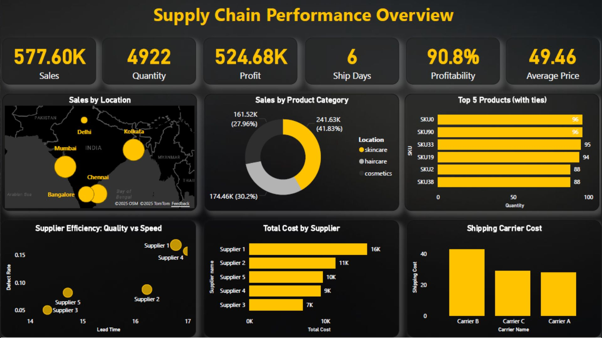
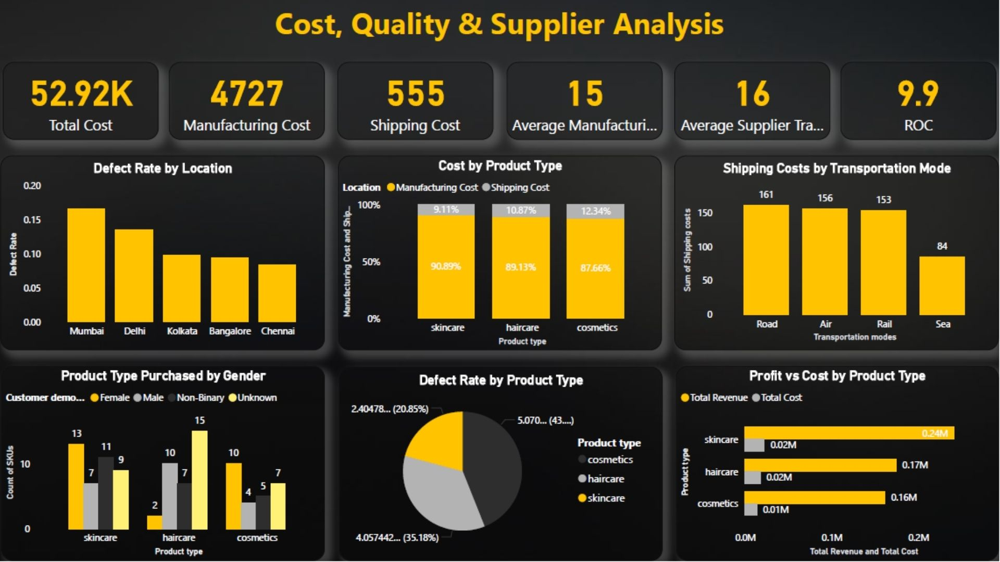
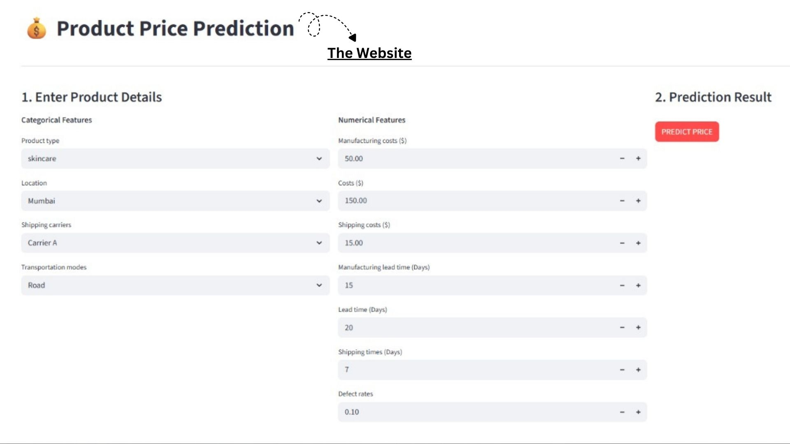

# 📦 Supply Chain Analysis Dashboard

### 🧰 Tools Used

---

## 📋 Overview
This project combines **Power BI** dashboards with a **Machine Learning** model to analyze supply chain operations and predict product prices.

The dashboard provides valuable insights into sales performance, supplier efficiency, shipping costs, product profitability, and quality metrics. Additionally, a **Streamlit web application** enables users to predict product prices based on supply chain features, helping businesses make smarter pricing decisions.

---

## 🧠 Objectives
- Monitor overall supply chain performance using interactive KPIs.
- Analyze sales and profit across different product categories.
- Evaluate supplier efficiency based on lead time and defect rates.
- Compare manufacturing and shipping costs.
- Analyze transportation modes and shipping carriers.
- Identify high-performing products and suppliers.
- Predict product prices using a Machine Learning model.

---

## 🖼️ Dashboard Preview

### 🧩 Supply Chain Performance Overview

### 📊 Cost, Quality & Supplier Analysis

### 🤖 Product Price Prediction Website

---

## 📈 Key Insights
- **Total Sales:** 577.60K
- **Total Profit:** 524.68K
- **Profitability:** 90.8%
- **Total Quantity Sold:** 4,922
- **Average Product Price:** 49.46
- **Average Shipping Time:** 6 Days
- **Top Product Category:** Skincare (41.83% of Total Sales)
- **Highest Supplier Cost:** Supplier 1 (16K)

---

## 💡 Business Insights & Recommendations
- Focus on expanding high-performing product categories such as **Skincare**.
- Optimize supplier selection by balancing lead time and product quality.
- Monitor suppliers with high defect rates to improve product quality.
- Reduce manufacturing and logistics costs to maximize profitability.
- Improve shipping efficiency by choosing the most cost-effective transportation methods.
- Utilize the Machine Learning model to support pricing strategies and business planning.

---

## 🛠️ Tools & Techniques Used
- **Power BI** → Interactive dashboards, KPI reporting, and business intelligence.
- **Python** → Data preprocessing, analysis, and Machine Learning.
- **Scikit-learn** → Product price prediction model.
- **Streamlit** → Interactive web application deployment.
- **DAX (Data Analysis Expressions)** → Custom KPIs and calculated measures.
- **Data Modeling** → Building relationships between multiple supply chain datasets.

---

## 📂 Project Features
- 📊 Interactive Power BI Dashboards
- 🤖 Machine Learning Price Prediction
- 🌐 Streamlit Web Application
- 📈 Supply Chain Performance Analysis
- 🚚 Shipping & Supplier Performance Insights
- 💰 Cost & Profitability Analysis
